# User guide — `uae-fwa-engine`

This is an operational manual for the people who use the tool: a claims reviewer working a queue,
a policy owner deciding whether a control may go live, an analyst deciding whether a model has
earned promotion, an auditor checking that what happened is what was supposed to happen.

Every screenshot in it was captured by `tools/capture_screenshots.py` from a running instance,
signed in with the real seeded credentials for the role named in the caption. None is a mock-up, a
wireframe or an edited image. Where a screen shows an unflattering number — a gate that does not
pass, a model that stays in shadow, a metric reported as unmeasurable — that is what the system
actually rendered.

The figures quoted throughout come from a run over the 20,893 claims in
`data/claims_demo_synthetic.csv`, the synthetic file this project generates to exercise the engine
(`docs/DEMO_DATASET.md` explains what it is for and what no figure derived from it may be used to
claim). Load a different file on the **Data** page and every one of them changes, which is the
point of that page existing.

---

## 1. What the tool does, and what it refuses to do

The engine takes a file of claims, runs a catalogue of 164 governed controls over it, correlates
what those controls find into cases, prices the exposure conservatively, and puts a prioritised,
evidence-backed queue in front of a human reviewer.

It does not decide that anyone committed fraud. That refusal is the single constraint the whole
system is organised around, and it is worth stating in the form the tool itself uses:

> **A signal is not a fraud finding.** This system can establish non-payability, inconsistency or
> statistical abnormality. It cannot establish intent, and intent is what distinguishes fraud from
> waste, abuse or honest error. Only a human reviewer, on evidence, may reach a conclusion about
> conduct.

That statement appears on every page and cannot be dismissed. It is also enforced in code rather
than by convention: a control whose type is statistical, network, text or model is *rejected at
registration time* if it declares `REJECT` or `REPRICE`. The application will not start with one
loaded. There is no configuration flag, threshold or override that makes an anomaly score into a
denial, because the check happens before any of those exist.

Only a **hard, objective, effective-dated condition** may deny a claim. "This member's coverage
had lapsed on the service date" can deny. "This provider's amounts are 3.2 robust standard
deviations above its peer group" cannot, at any threshold, under any configuration.

### The eight dispositions

Every case carries exactly one of eight outcomes. They are not severity levels; they are different
kinds of instruction to a different person.

| Disposition | What it means | Who acts |
|---|---|---|
| `REJECT` | An objective condition failed. Do not pay. | Claims |
| `REPRICE` | The amount is wrong by a computable rule. | Claims |
| `RETURN` | The submission is incomplete or malformed. | Provider |
| `PREPAY_PEND` | Hold before payment; something needs checking. | Reviewer |
| `POSTPAY_AUDIT` | Pay, then examine the pattern. | Audit |
| `SIU_LEAD` | Worth an investigator's time. Not an accusation. | SIU |
| `PROVIDER_EDUCATION` | Looks like a billing habit, not misconduct. | Network |
| `MONITOR_ONLY` | Watch. Do nothing yet. | Analytics |

The first three are available only to hard controls. The rest are where everything statistical
ends up.

---

## 2. Getting in

```bash
pip install -e .
streamlit run app/Home.py
```

The tool runs with **no API key and no network access**. Nothing in it calls out.

On first start it seeds one account per role and prints the credentials to the console **once**.
Every seeded account is forced to change its password at first sign-in.

| Sign in as | Role | Typical job title |
|---|---|---|
| `reviewer` | CLAIMS_REVIEWER | Claims reviewer |
| `clinical` | CLINICAL_REVIEWER | Clinical / coding policy |
| `siu` | SIU_INVESTIGATOR | SIU investigator |
| `policy` | POLICY_OWNER | Policy owner |
| `admin` | ADMIN | Administrator |
| `analyst` | ANALYST | Analytics / ML engineering |
| `qa` | QA | Quality assurance |
| `auditor` | AUDITOR | Regulator / internal audit |

What a role can reach is decided by its permissions, and the navigation is *built* from them. A
page a role may not see does not appear in its sidebar and is not registered with the router for
that session, so it cannot be reached by URL either. The guard re-checks on entry, so a forged
page reference fails closed and the attempt is written to the access log.

This authentication layer demonstrates the access-control model. It uses Argon2 password hashing,
enforces separation of duties and masks patient identity by default — and it is **not hardened for
real PHI**.

---

## 3. Overview — what this run found

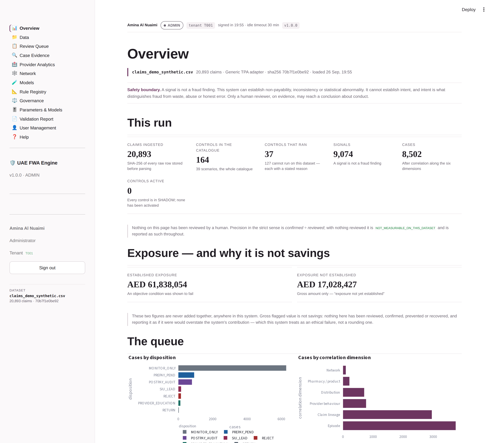

*Overview, signed in as `admin`. The two exposure figures are deliberately side by side and are
never added together.*

The Overview answers "what happened in this run" in five numbers and then immediately qualifies
them. On the shipped dataset: 20,893 claims ingested; 164 controls in the catalogue; **37** of
them could run, and all 37 fired; 9,074 signals; 8,502 cases. **Zero controls active** — every one
is in shadow, because activation requires a prospective shadow period and a policy owner who did
not author the rule, and neither exists in a single retrospective run.

Below that sits the distinction the whole system is organised around:

- **Established exposure** (AED 61,838,054 here) — an objective condition was shown to fail.
- **Exposure not established** (AED 17,028,427) — the gross amount, shown with the literal words
  *"exposure not yet established"*.

**These two figures are never added together, anywhere in this system.** Gross flagged value is
not savings: nothing here has been reviewed, confirmed, prevented or recovered, and reporting it as
if it were would overstate what the system has contributed. The tool treats that as an ethical
failure rather than a rounding one, which is why the two numbers are rendered as separate tiles
with separate labels and no total beneath them.

The dataset profile at the foot of the page names the file, its row count, its date range and its
adapter, alongside the canonical model's population report — sixteen tables, each marked
`POPULATED`, `PARTIAL` or `NOT_POPULATED` with a reason. A table that is empty because the source
has no such data is a **finding**; a table filled with plausible invented rows would be a lie that
propagates into every downstream number.

---

## 4. Data — loading a file and re-running everything

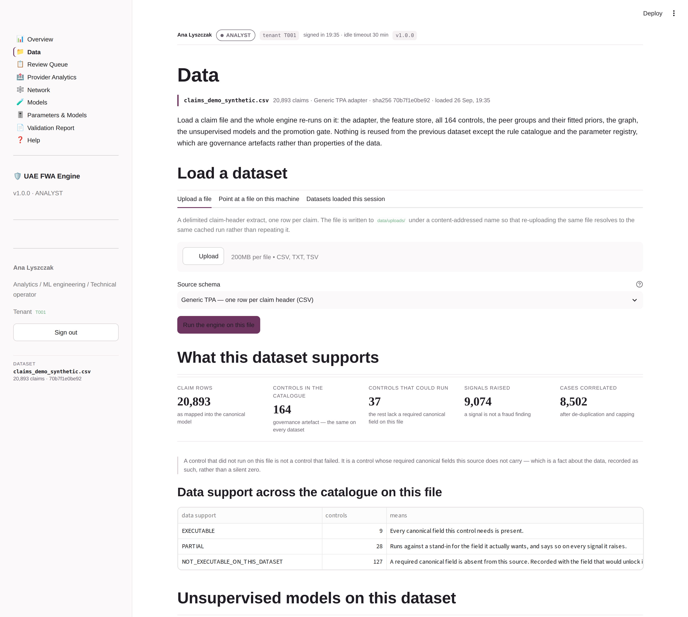

*The Data page. Available to ANALYST and ADMIN.*

Every figure in the application is a property of one input file. This page is where that file is
chosen.

**Upload a file** takes a delimited claim-header extract by drag-and-drop. The file is written
under `data/uploads/` with a content-addressed name, which has a useful consequence: uploading the
same file twice resolves to the same cached run instead of repeating twenty seconds of work.

**Point at a file on this machine** takes a full path instead. Use it for anything large, and for
anything the browser is not permitted to read — which is the ordinary case for a file on a work
share. The file is read in place and never copied.

**Source schema** picks the adapter that maps the file's columns into the canonical model. Choosing
the wrong one does not silently mis-map: columns the adapter cannot find are recorded as missing,
and the controls that need them are classified `NOT_EXECUTABLE_ON_THIS_DATASET` rather than run on
a guess.

### What "re-runs everything" means

Pressing **Run the engine on this file** re-runs the pipeline end to end. The adapter maps the
source schema; the feature store rebuilds; all 164 controls are re-evaluated; the peer groups and
their Beta priors are refitted; the graph is rebuilt; the unsupervised models are retrained on the
new temporal and entity-isolated split; the promotion gate is re-run against the transparent
composite. Nothing carries over from the previous dataset except the rule catalogue and the
parameter registry, which are governance artefacts rather than properties of the data.

Each run is cached on the **content hash** of its input file, so switching back to a dataset loaded
earlier is free and does not discard what has already been computed.

### Reading the comparison

The most interesting difference between two datasets is usually not how many signals each produced
but **which controls could run at all**. A file carrying an authorisation table brings an entire
scenario family to life; a file without `agent_id` kills the distribution-channel controls
outright. Once a second dataset is loaded, the control table gains a comparison column reporting
exactly that: *Newly runnable*, *No longer runnable*, *±N signals*, or *Unchanged*.

Three tiles above it summarise the same thing at a glance, and the whole table downloads as CSV.

A control that did not run is not a control that failed. It is a control whose required canonical
fields this source does not carry — a fact about the data, recorded as such, rather than a silent
zero.

---

## 5. Review Queue — one reviewer's work, in order

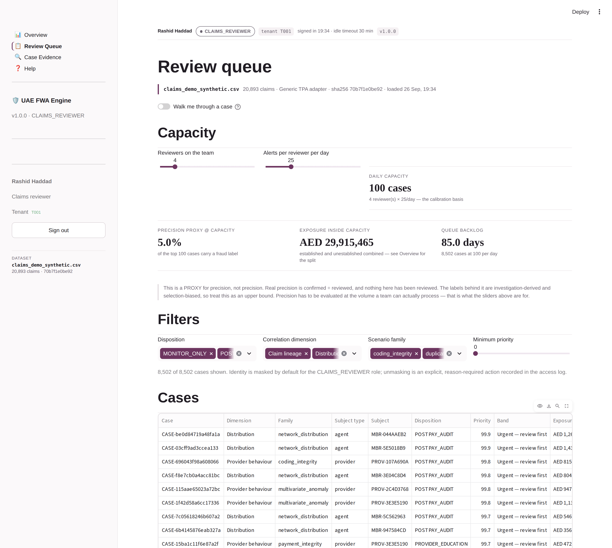

*The review queue as a CLAIMS_REVIEWER sees it. Identity is masked by default.*

The queue is ordered by a priority score, and the score orders the queue **only**. It never sets,
overrides or softens a disposition: disposition is a policy decision, priority is a scheduling one,
and conflating them would let a scoring tweak change what happens to a claim.

Each row carries its disposition chip, its priority band, the number of signals behind it, the
number of claims those signals touch, and its exposure — with `exposure_established` shown
explicitly, so a large number that has not been established is never mistaken for one that has.

Filters narrow by disposition, band, correlation dimension and scenario family. The capacity line
above the table is worth reading: it computes how many cases the configured review team can
actually process in a day, and shows precision *at that volume* rather than at an arbitrary
threshold. A detector that looks excellent on the top ten and mediocre on the top four hundred is
described honestly by the second number and flattered by the first.

Patient and provider identifiers are masked. Unmasking is a separate, reason-required action
available only to roles that hold the permission, and it writes an entry to the access log naming
who unmasked what and why.

---

## 6. Case Evidence — reaching a defensible decision

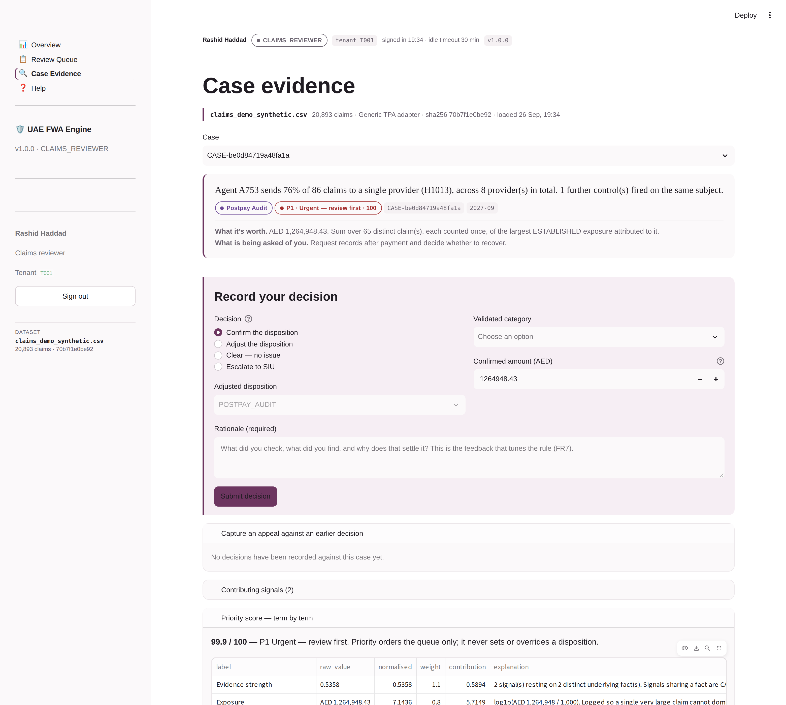

*One case. The verdict sentence first, then the evidence, then the decision.*

This is the screen the tool is designed around. The target is that a reviewer can open a case and
reach a defensible disposition in under a minute, without training.

It leads with a **sentence**, not a score: what fired, on what, and what the reviewer is being
asked to do about it. Underneath sit, in order:

- **The signals**, each with the control that raised it, the control's version, the exact
  expression it tests, the exclusions it declares, and the evidence fields it rendered. Where a
  control ran against a stand-in for the field it actually wanted, that substitution is named on
  the signal itself.
- **The priority arithmetic**, term by term, with each term's weight, its normalised value and its
  contribution — so the score can be reconstructed by hand rather than taken on trust.
- **The exposure basis**, in words, saying what the amount is and whether it has been established.
- **The AI panel**, if one is present, on a dashed border and a different background, labelled
  *AI-generated summary — not evidence*. A reviewer should never have to work out whether they are
  reading evidence or a generated paraphrase of it.

Where several signals rest on the **same underlying fact**, they are capped at the strongest rather
than summed. Three controls noticing the same unusual amount is one piece of evidence noticed three
times, and adding them would manufacture confidence out of redundancy.

### Recording the decision

The disposition form is the one primary action on the screen. It requires a rationale in free text;
a disposition without one is refused. If an exclusion applies, name it in the rationale — the
control's declared exclusions are listed directly above the form for exactly this purpose.

Everything recorded here goes to the append-only audit log: who, when, which case, which
disposition, which rationale, and the hash chaining it to the entry before it.

### The copilot

The copilot answers questions about the case, bounded to three sources and no others: the case's
own evidence bundle, the rule text of the controls that fired, and the parameter registry entries
those rules reference. There is no path from it to the full claim table, to another tenant's data,
or to the held-out labels.

Ask it *"why did this fire?"*, *"what exclusion might apply?"* or *"what would I need to confirm
this?"* and it will answer. Ask it *"is this fraud?"* — in any phrasing — and it returns the safety
boundary statement instead. That refusal is classified before any model is called, so it is not
something a sufficiently determined rephrasing can talk its way past.

---

## 7. Provider Analytics — comparing like with like

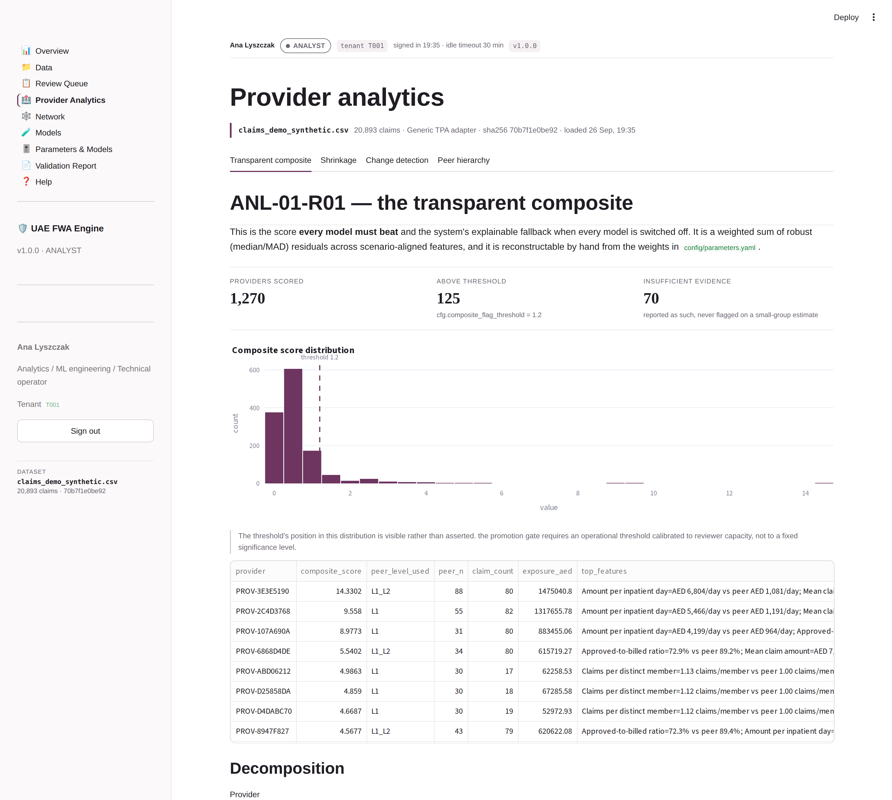

*Peer comparison, shrinkage and change detection.*

A provider is never compared to the whole book. It is compared to a peer group built by walking a
six-level hierarchy — activity/code family, specialty, encounter/facility type,
payment-method/contract family, geography, provider volume band — from the most granular level
down, stopping at the first group large enough to support an estimate. **Which level was used is
stamped on every comparison**, because a residual computed against 2,000 providers nationally and
one computed against 31 providers in the same specialty are not the same claim.

Where the walk runs out before reaching `min_peer_group_n`, the comparison is **refused** and
reported as `INSUFFICIENT_PEER_EVIDENCE`. That is a different statement from scoring zero, and the
tool keeps it different everywhere it appears.

### Shrinkage, and why the page demonstrates it

A provider with five claims and one adverse event has an observed rate of 20%, which is close to
meaningless. A provider with five thousand claims and the same 20% is a genuine outlier. The page
shows both, side by side, with the same observed rate and visibly different shrunk rates and
interval widths. It is the whole argument for the estimator in one table.

Every shrunk rate is reported **with its posterior interval**, and an entity whose interval is
wider than the configured maximum is marked `excluded_from_ranking` rather than flagged on an
artificially precise point estimate.

### Change detection

CUSUM and EWMA detect shifts in a provider's monthly behaviour. A change point is only *declared*
once there is a configured minimum of history behind it, and each declared point comes with a
plain-language explanation of what shifted, when, and by how much.

---

## 8. Network — structure, not accusation

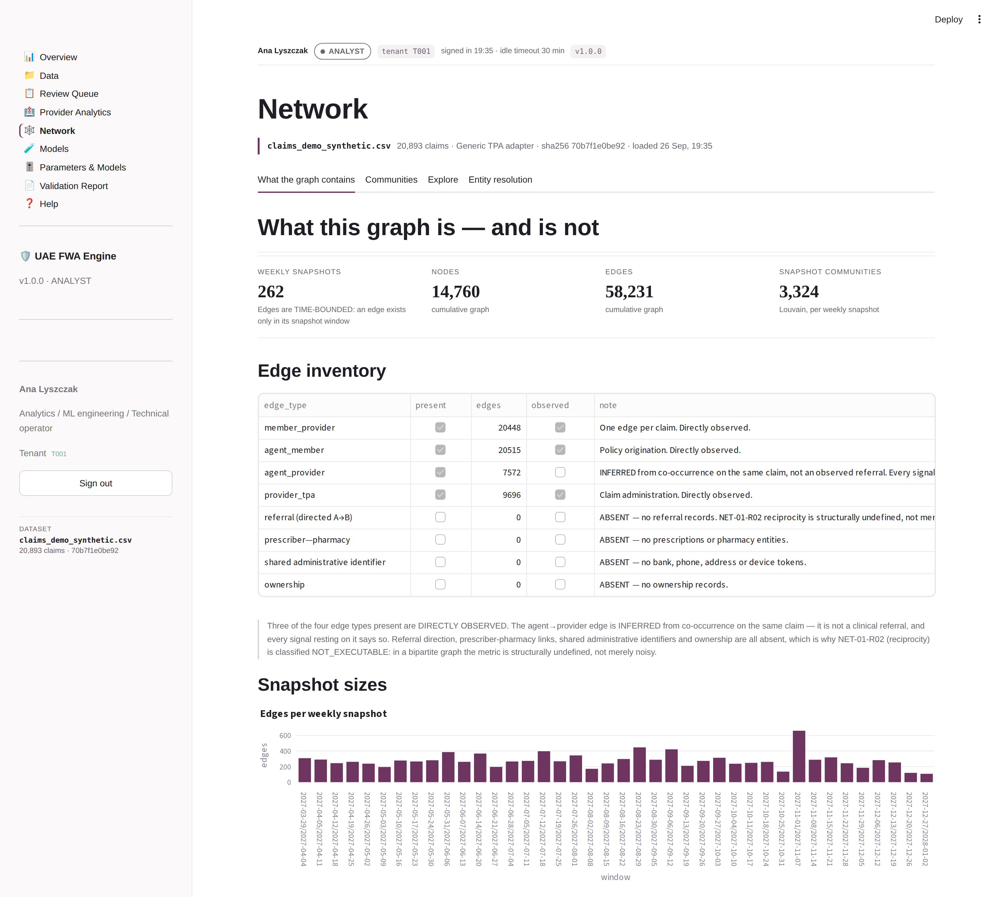

*Typed, time-bounded graph with community detection and entity-resolution candidates.*

Edges are materialised into weekly, time-bounded snapshots: an edge exists only within its window,
so a relationship that existed in March is not silently available as evidence about June.

Communities are detected per snapshot, and a community's unusualness is tested against
**size-matched** comparison communities rather than against a global average — otherwise every
large community looks unusual for no better reason than being large.

Entity-resolution candidates — two legally distinct providers sharing a bank account, a phone
number, an address token — are **surfaced for human confirmation and never merged automatically**,
at any confidence. The configured auto-merge threshold is set deliberately above 1.0, which is to
say unreachable, and the page says so.

---

## 9. Models — candidates, not products

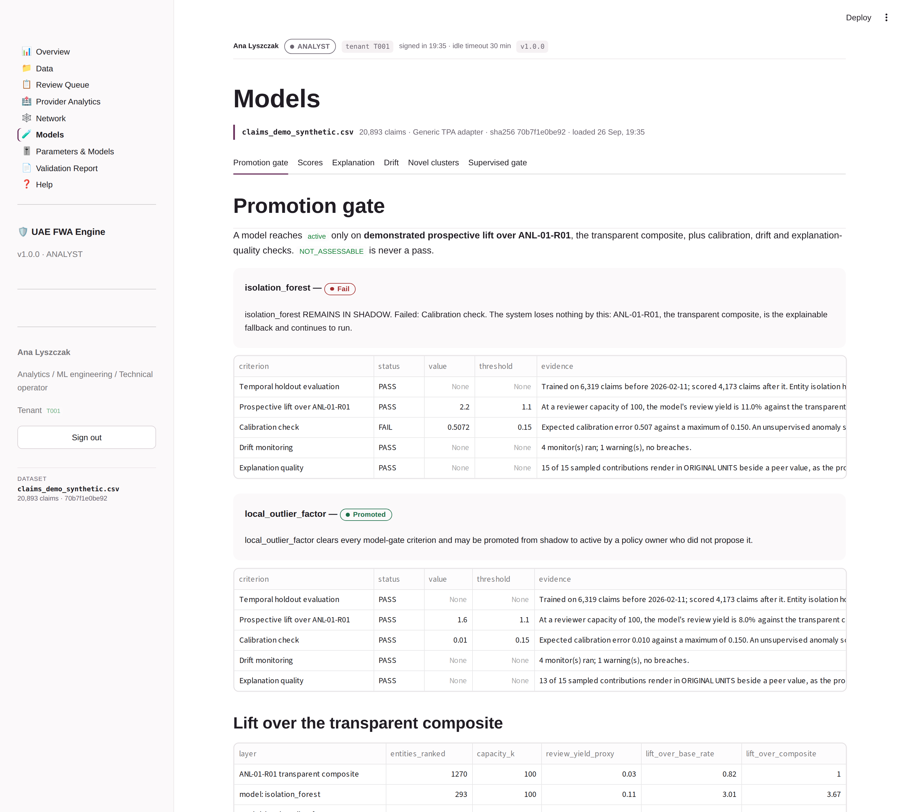

*The promotion gate verdict comes first, before any score distribution.*

Two unsupervised baselines are fitted: an Isolation Forest and a Local Outlier Factor. Both are
**candidates**. The transparent statistical composite is the incumbent, and a model reaches
`active` only by beating it.

The page leads with the gate verdict rather than with score distributions, because a models page
that opens with a histogram invites the reader to treat the model as the product.

### What the gate checks

- **Temporal holdout** — training data is strictly earlier than scoring data.
- **Entity isolation** — no provider appears in both training and scoring. Without this a model can
  score a provider it was trained on and post a lift figure that is partly memory.
- **Prospective lift over the composite** — measured on a strictly later period.
- **Calibration** — expected calibration error within the configured maximum.
- **Drift** — PSI within threshold.
- **Explanation quality** — every flagged entity must produce feature attributions in original
  units beside the peer value.

`NOT_ASSESSABLE` is **never** a pass. A criterion that cannot be evaluated is a reason not to
promote, not a reason to shrug. On the shipped dataset `local_outlier_factor` clears all five
criteria and may be promoted by a policy owner who did not propose it, while `isolation_forest`
clears four — including the *higher* lift, 2.2× against 1.6× — and fails calibration alone. The
page names the criterion it failed rather than quietly reporting a score. That asymmetry is not a
defect in either model: two unsupervised scores judged against one outcome series cannot both
satisfy the calibration criterion, and `docs/DEMO_DATASET.md` gives the proof.

### Explanations

SHAP contributions are rendered in **original units beside the peer value**, not as bare
magnitudes:

> Amount per inpatient day — AED 6,804/day, peer median AED 1,081/day (6.3×) → pushed this
> provider's composite score up the most

The explainer actually used is named on the page. Where the estimator has a tree structure, SHAP's
exact tree method is used; where it does not, the kernel approximation over a k-means-summarised
background is used instead — and being an approximation, it is named rather than presented as the
exact thing.

---

## 10. Parameters & Models — every number, and where it came from

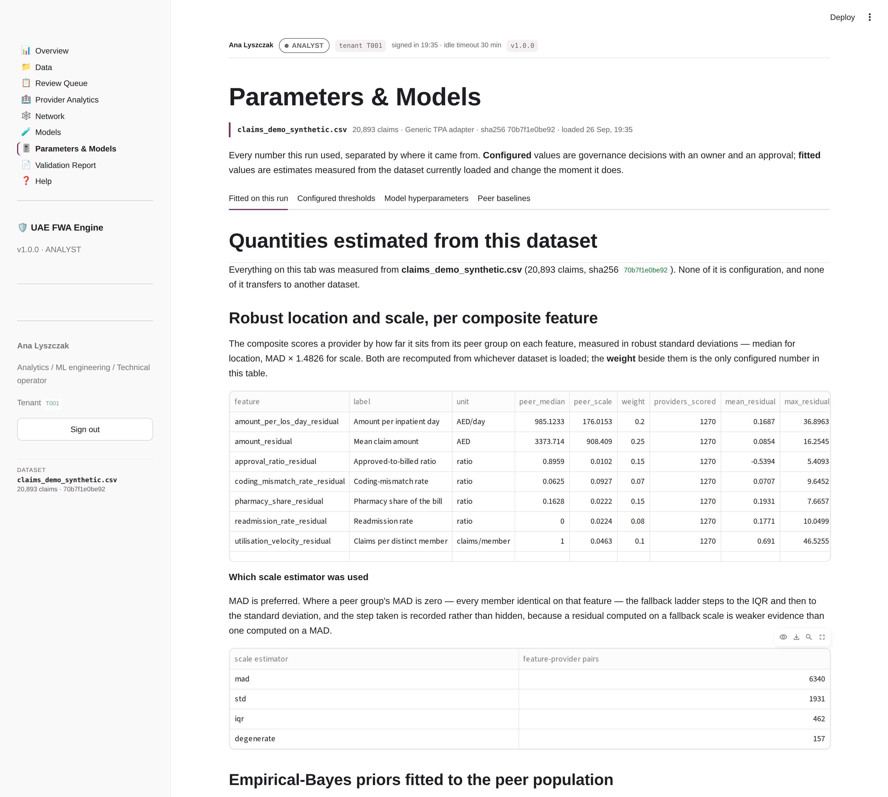

*Four tabs, separating measurements from decisions.*

There are two kinds of number in this system, and confusing them is the most expensive mistake a
reader can make.

A **configured threshold** is a governance decision. Somebody owns it, somebody approved it, it has
a written rationale and a date from which it takes effect. It does not change because the data
changed. `min_peer_group_n = 30` is a statement about how much evidence the organisation requires
before it will allow a comparison, and it would be the same number on a dataset a hundred times the
size.

A **fitted quantity** is a measurement. A Beta prior's α and β, a peer group's median and MAD, a
model's decision threshold: each is estimated from the file currently loaded and is meaningless
away from it.

The four tabs keep them apart:

**Fitted on this run.** Robust location and scale per composite feature, with the count of
providers each was estimated from; which scale estimator was used, since a residual computed on an
IQR fallback is weaker evidence than one computed on a MAD; the empirical-Bayes priors, with their
strength in pseudo-observations and the α and β that follow from it; and the run's own facts —
parameter fingerprint, random seed, stage timings.

**Configured thresholds.** Every `cfg.*` value with its owner, approver, effective dates and prose
rationale, filterable and downloadable. No threshold in this system is a literal in a source file,
and the reason is simple: a number without an owner is a number nobody can be asked about. The tab
also counts the parameters past their review date — still in force, and surfaced rather than
silently applied.

**Model hyperparameters.** Read off the trained estimators rather than off the configuration that
requested them, so a value that was clipped, defaulted or overridden shows as what it became. The
split the models were fitted under is shown beside them, with the provider overlap between training
and scoring stated explicitly.

**Peer baselines.** The six hierarchy levels with their availability on this dataset, the back-off
order, and the count of providers whose comparison actually landed on each step.

---

## 11. Rule Registry — the catalogue as configuration

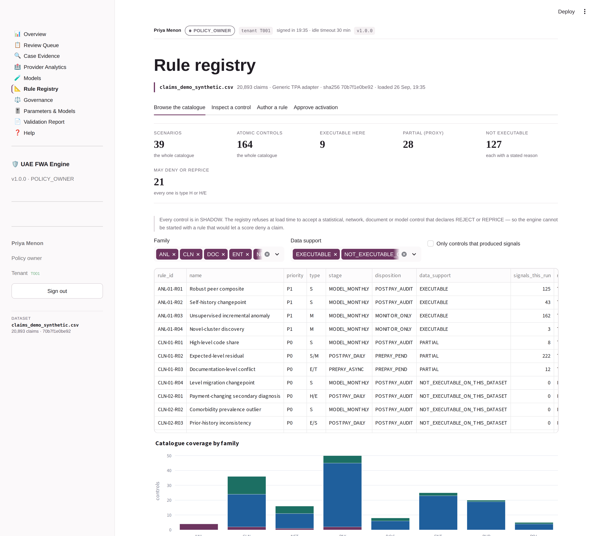

*All 164 controls across 39 scenarios, each with its verbatim trigger and its governed mapping.*

Every control is a configuration record, not a function buried in a module. Each carries its
identifier, version, type, execution stage, the population it tests, the expression it evaluates,
its parameters *as references to the registry rather than as literals*, its declared exclusions,
its grouping key, its disposition, and its data support on the loaded dataset.

Data support is the honest part. On the shipped file: 9 controls `EXECUTABLE`, 28 `PARTIAL`, 127
`NOT_EXECUTABLE_ON_THIS_DATASET`. Each of the 127 names the canonical field that would unlock it,
which turns "what would real data buy us?" from a rhetorical question into a list.

Where the catalogue's first-named disposition would be illegal for a control's type — a statistical
control the catalogue describes as "reject/pend", for instance — the substitution is recorded in a
`governance_note` on the control, visible here. The catalogue is followed; the boundary is not
crossed; and the place where the two disagreed is written down instead of being smoothed over.

Every control starts in `shadow`. Activation requires a policy owner **who did not author it**.

---

## 12. Governance — effective dating, ceilings and the kill switch

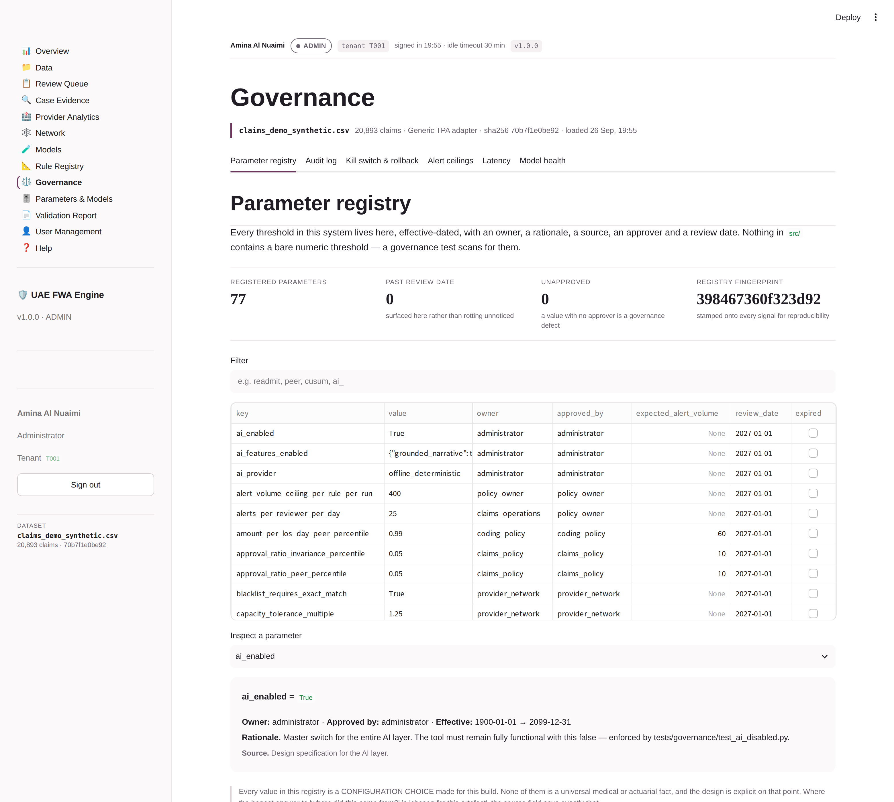

*Parameter provenance, alert ceilings, stage latency, and the audit log.*

This page is where the machinery that makes the rest trustworthy is visible.

**Parameter provenance.** Every value with its owner, rationale, source, approval and review date.
Values past their review date are flagged. Unapproved values are flagged. Neither is silently
dropped or silently honoured.

**Alert ceilings.** A runaway control must not flood the queue. A control exceeding its configured
ceiling is automatically routed to `MONITOR_ONLY` and raises a governance event. Breaches from this
run are listed.

**Stage latency.** Observed time per execution stage against the configured ceiling. The observed
figure is the *batch* time across the whole file rather than a per-claim online latency, and the
page says so — a real synchronous prepay deployment would be measured per claim, and this artefact
runs as a batch.

**Kill switch and rollback.** Any control can be suspended, and any control can be rolled back to a
prior registered version, without a code deployment. Both write to the audit log.

**The audit log** itself is append-only and hash-chained: each entry carries the hash of the one
before it, so a deletion or an edit breaks the chain visibly. Unmasking, overriding and
kill-switching are reason-required actions — the entry is refused without one.

---

## 13. Validation Report — the honest scorecard

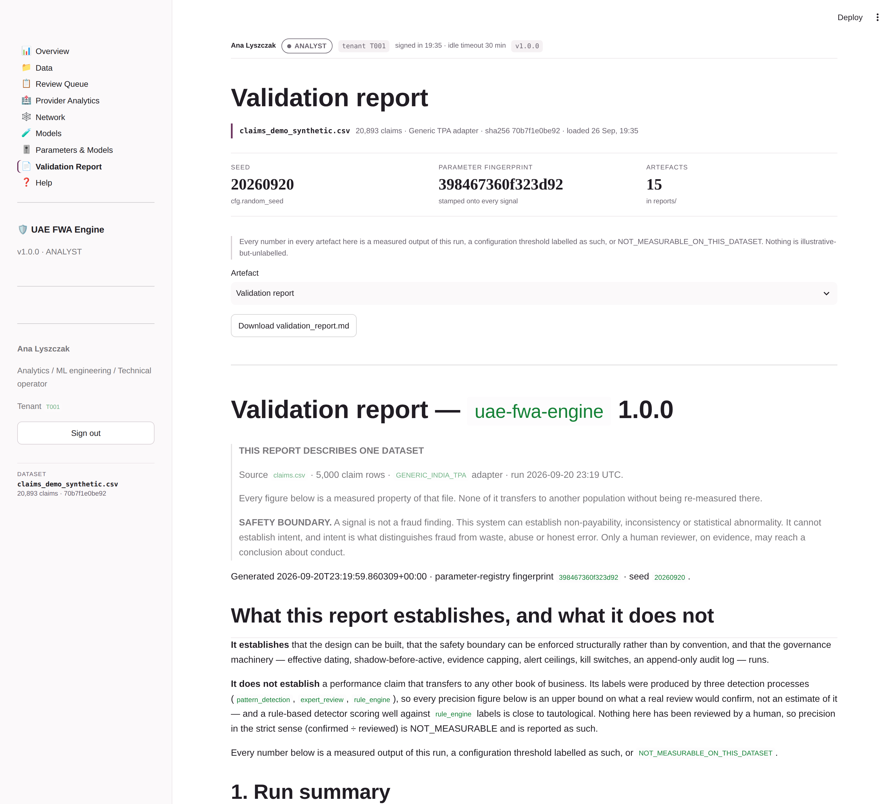

*Generated from the same run the rest of the application is showing.*

The report is built from the same `PipelineResult` the pages render, so the report and the
interface cannot disagree about what the run found.

Every number in it is one of three things: a measured output of this run, a configuration threshold
labelled as such, or `NOT_MEASURABLE_ON_THIS_DATASET`. Nothing is illustrative-but-unlabelled.

A good deal is reported as unmeasurable, and deliberately so. Precision in the strict sense is
*confirmed ÷ reviewed*; nothing here has been reviewed by a human, so precision, review yield,
confirmed AED, prevented and recovered AED, net savings, abrasion, turnaround and overturn rate are
all unmeasurable. They are implemented and reported as unmeasurable rather than dropped, because a
metric that quietly disappears is a metric nobody notices is missing.

Where precision-like figures do appear, they are computed against labels that were themselves
produced by detection processes, so they are **upper bounds** on what a real review would confirm —
and a rule-based detector scoring well against rule-engine labels is close to tautological. The
report says this in the same place it prints the number.

`python -m fwa.run_validation` regenerates every report file. Two runs from the same input and seed
produce identical findings; only wall-clock fields — elapsed milliseconds, timestamps — differ.

---

## 14. User Management — accounts, roles and separation of duties

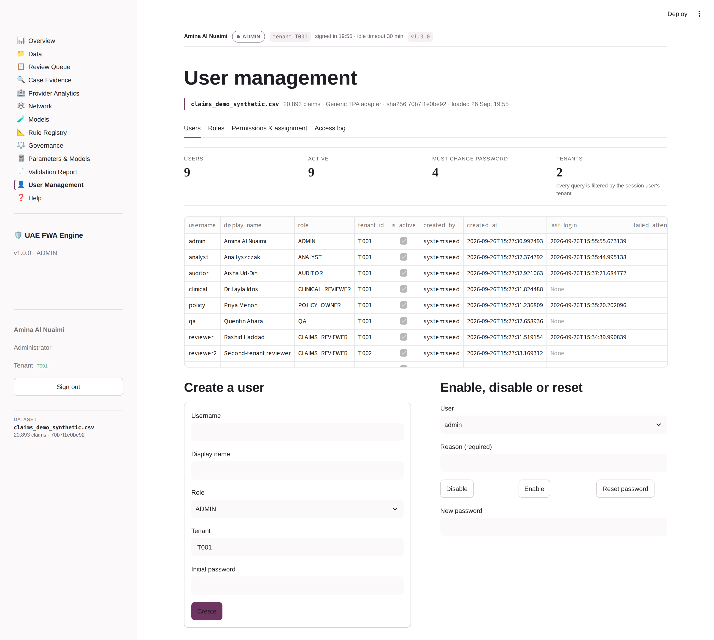

*Available to ADMIN only.*

Accounts are created, assigned a role and a tenant, and activated or deactivated here. Role changes
are audited. Tenant assignment is enforced everywhere: a session sees its own tenant's cases and no
others, and that isolation is tested rather than assumed.

Separation of duties is enforced in code, not by policy document. The user who authors a rule may
not approve its transition from shadow to active. The user who proposes a model promotion may not
approve it. Attempting either raises an error and writes the attempt to the audit log.

---

## 15. Help — this guide, in the tool

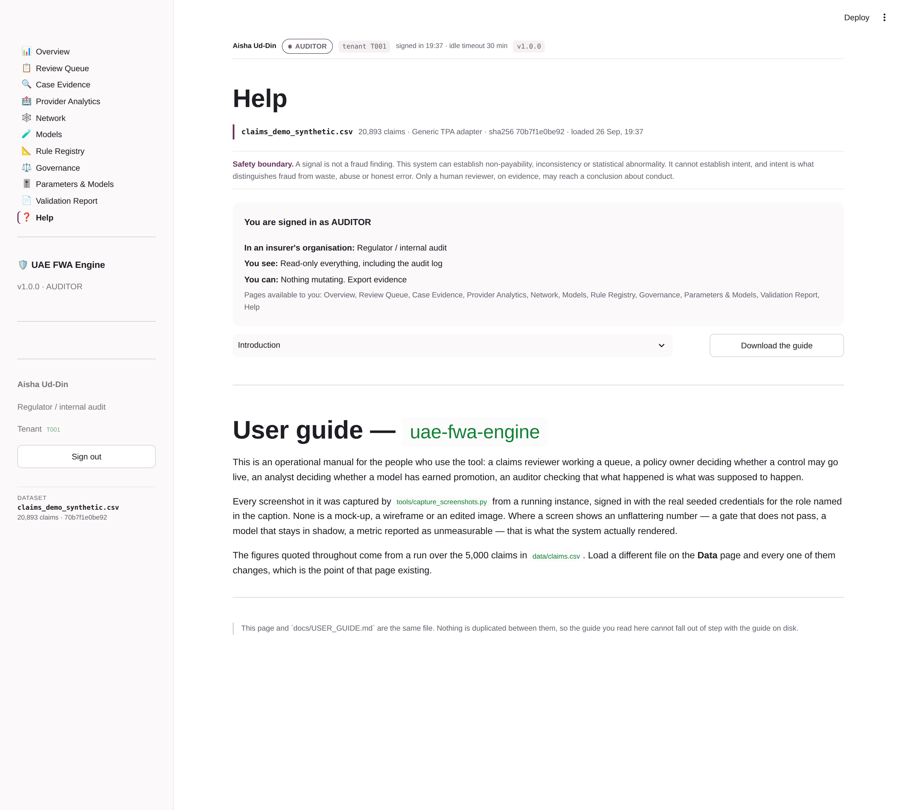

*The same file you are reading, rendered in the application it documents.*

The Help page renders `docs/USER_GUIDE.md` directly, split by section. Nothing is duplicated
between the two, so the guide in the tool cannot drift out of step with the guide on disk. The
screenshots render inline, and a screenshot missing from the checkout is shown as missing rather
than silently skipped.

The card at the top of the page describes the signed-in role: what it maps to in an insurer's
organisation, what it can see, what it can do, and exactly which pages are available to it.

---

## 16. Light and dark

The interface ships light. To switch it to dark, open `.streamlit/config.toml`,
comment out the `LIGHT` theme block, uncomment the `DARK` one, and restart the app.

Both halves of the interface — Streamlit's own widgets and this application's
stylesheet — read that one setting, so they cannot end up disagreeing. If you have
seen a Streamlit app render dark text on a dark background after changing your
desktop theme, that disagreement is the cause: the stylesheet asks the operating
system what it prefers, which is a different question from what theme the
application is actually running. Nothing here asks the operating system anything.

---

## 17. Reading a number in this tool

A short checklist, because most of the design decisions above amount to the same few habits.

1. **Check whether exposure is established.** A large number with "exposure not yet established"
   beside it is a gross amount, not a loss.
2. **Check the peer level.** A residual is only as strong as the group it was measured against, and
   the group is always named.
3. **Check the posterior interval.** A shrunk rate without one, or with one too wide to rank, is
   not a finding.
4. **Check the data support.** A `PARTIAL` control is running against a stand-in, and it says which
   one on every signal.
5. **Check whether anything has been reviewed.** Almost every precision-shaped number in this
   artefact is an upper bound derived from labels, not a measurement of review outcomes.
6. **Check the disposition against the control type.** If something statistical appears to be
   denying a claim, that is a bug, and the contract validator should have refused to load it.

And the one that outranks the rest: a signal is not a fraud finding. The tool is built so that
nothing it produces can be mistaken for one — and where it might be, it says so on the screen.
